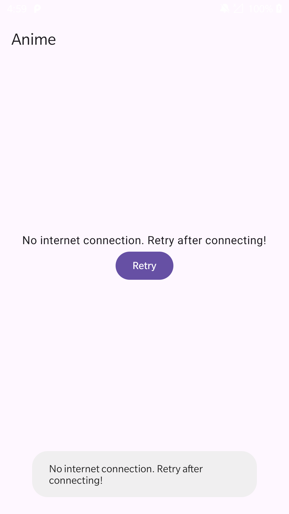
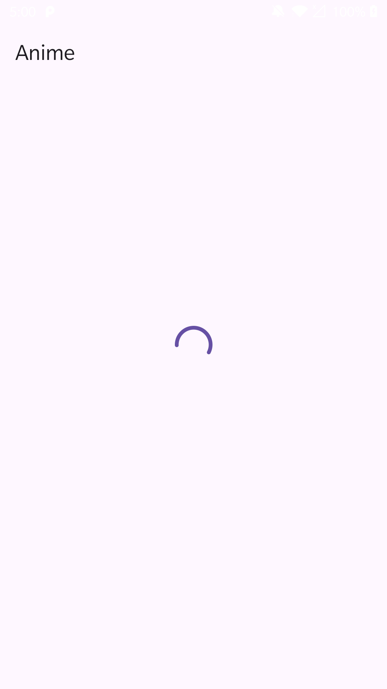
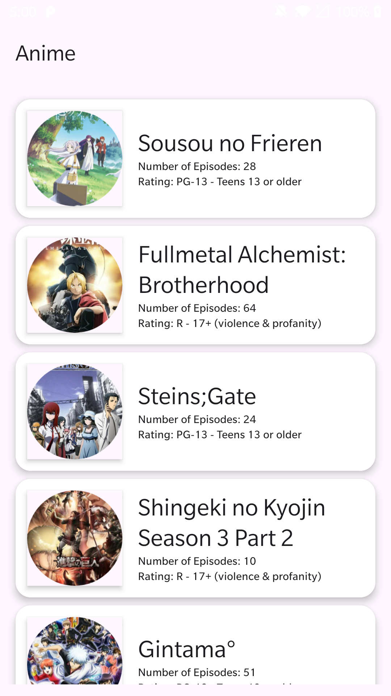

## 📌 Assumptions Made
- The app uses the [Jikan API](https://jikan.moe/) to fetch anime data.
- Internet connectivity is required for the initial data sync.
- Offline mode is supported via Room database persistence.

---

## 🚀 Features Implemented
- Fetch and display a list of top anime titles.
- View detailed anime information including trailer, genres, and synopsis.
- Offline caching of anime data using Room.
- Network connectivity check before making API calls.
- MVVM architecture with Hilt for dependency injection.
- Jetpack Compose UI with LazyColumn for efficient list rendering.
- Navigation between anime list and detail screens using `androidx.navigation.compose`.

---

## ⚠️ Known Limitations
- Pagination for the anime list is not yet implemented.
- Search functionality is currently missing.
- Trailer embedding may fail if the YouTube URL is invalid or unavailable.
- No dark mode toggle available.
- Error messages are basic and use Toasts for display.

---

## 📱 Working App Demonstration
### 🔗 APK File
You can download the latest APK from the [Releases](https://github.com/nikheelkamble4/AnimeSeries/releases) section.  
Alternatively, [click here](https://github.com/nikheelkamble4/AnimeSeries/releases/download/v1.0.0/Anime.apk) for a direct download.

### 🖼️ Screenshots

